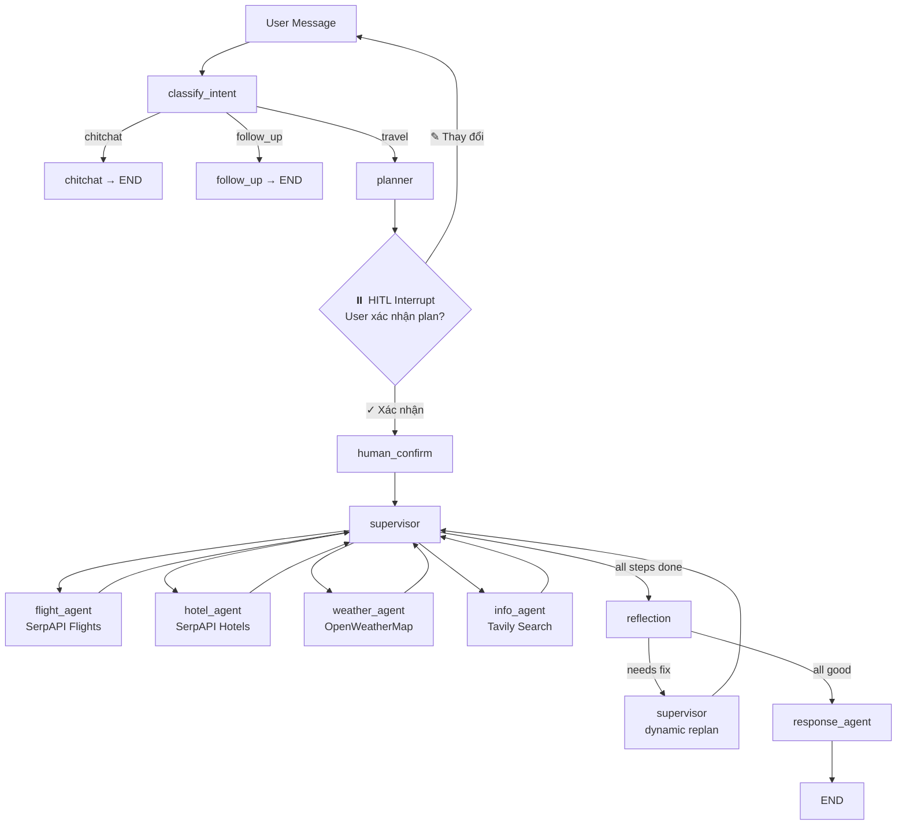

# Travel AI Assistant

Agentic AI chatbot tìm vé máy bay, khách sạn, tra cứu thời tiết, tìm kiếm thông tin du lịch — xây dựng bằng **LangGraph Multi-Agent** + **Gemini** + **FastAPI** + **React**.


---

## 🏗️ Kiến trúc hệ thống

**Multi-Agent Supervisor** architecture với Human-in-the-Loop:



### Giải thích từng thành phần

| Thành phần | File | Vai trò |
|-----------|------|---------|
| **classify_intent** | `nodes/classify_intent_node.py` | Phân loại intent: `travel` / `chitchat` / `follow_up` |
| **planner** | `agents/planner_agent.py` | Phân rã yêu cầu → `TripPlan` (steps + constraints) bằng structured output |
| **human_confirm** | `graphs/main_graph.py` | HITL gate — dừng để user xác nhận/hủy plan |
| **supervisor** | `agents/supervisor.py` | Dispatch agents theo plan, deterministic routing, dynamic replan |
| **flight_agent** | `agents/flight_agent.py` | Tìm vé máy bay qua SerpAPI Google Flights |
| **hotel_agent** | `agents/hotel_agent.py` | Tìm khách sạn qua SerpAPI Google Hotels |
| **weather_agent** | `agents/weather_agent.py` | Tra cứu thời tiết qua OpenWeatherMap |
| **info_agent** | `agents/info_agent.py` | Tìm kiếm thông tin du lịch qua **Tavily Search** |
| **reflection** | `agents/reflection.py` | Kiểm tra chất lượng kết quả, đề xuất sửa plan |
| **response_agent** | `agents/response_agent.py` | Tổng hợp tất cả kết quả → response cuối cùng |

### Tech Stack

| Layer | Công nghệ |
|-------|-----------|
| LLM | Google Gemini 2.0 Flash (structured output) |
| Agent Framework | LangGraph (StateGraph + MemorySaver) |
| Flight Search | SerpAPI (Google Flights) |
| Hotel Search | SerpAPI (Google Hotels) |
| Weather | OpenWeatherMap API |
| Web Search | Tavily Search API |
| Backend | FastAPI + SSE Streaming |
| Frontend | React 19 + Vite |

### Tính năng Agentic

| Tính năng | Mô tả | Điểm |
|----------|-------|------|
| **Multi-Agent Supervisor** | Planner phân rã → Supervisor dispatch → Reflection kiểm tra | 9/10 |
| **Planning & Decomposition** | Structured output `TripPlan`, IATA conversion, fallback date | 8/10 |
| **Dynamic Replanning** | Reflection detect issues → sửa constraints → re-run agents | 8/10 |
| **Human-in-the-Loop** | `interrupt_before` pause sau planner, user confirm/cancel | 7/10 |
| **Tool Use** | 4 tools (flights, hotels, weather, web search) via `create_react_agent` | 9/10 |

---

## 📁 Cấu trúc dự án

```
Travel AI Agent/
├── api.py                      # FastAPI server (SSE + HITL resume)
├── main.py                     # CLI chatbot
├── .env                        # API keys (không commit)
│
├── config/
│   ├── settings.py             # Env vars & LLM config
│   ├── constants.py            # IATA codes (city↔code + reverse lookup)
│   └── prompts.py              # Prompt templates cho tất cả agents
│
├── src/
│   ├── state/
│   │   └── agent_state.py      # AgentState TypedDict (shared state)
│   │
│   ├── graphs/
│   │   └── main_graph.py       # LangGraph pipeline + MemorySaver + HITL
│   │
│   ├── agents/                 # 🧠 Multi-Agent layer
│   │   ├── planner_agent.py    # Phân rã yêu cầu → TripPlan
│   │   ├── supervisor.py       # Dispatch agents + dynamic replan
│   │   ├── flight_agent.py     # Tìm vé máy bay (SerpAPI)
│   │   ├── hotel_agent.py      # Tìm khách sạn (SerpAPI)
│   │   ├── weather_agent.py    # Tra cứu thời tiết (OpenWeatherMap)
│   │   ├── info_agent.py       # Tìm thông tin du lịch (Tavily)
│   │   ├── reflection.py       # Kiểm tra chất lượng + đề xuất replan
│   │   └── response_agent.py   # Tạo response cuối cùng
│   │
│   ├── nodes/                  # Intent classification layer
│   │   ├── classify_intent_node.py
│   │   ├── chitchat_node.py
│   │   └── follow_up_node.py
│   │
│   ├── edges/
│   │   └── routing_edges.py    # Conditional routing
│   │
│   ├── tools/                  # 🔧 External API wrappers
│   │   ├── flight_search.py    # SerpAPI Google Flights
│   │   ├── hotel_search.py     # SerpAPI Google Hotels
│   │   ├── weather_search.py   # OpenWeatherMap
│   │   └── tavily_search.py    # Tavily Web Search
│   │
│   └── services/
│       └── llm_service.py      # Gemini LLM client
│
├── frontend/                   # React Web UI
│   ├── src/
│   │   ├── pages/ChatPage.jsx       # Main chat + HITL handling
│   │   ├── components/
│   │   │   ├── ChatBubble.jsx       # Chat bubble + InterruptBubble
│   │   │   ├── ChatInput.jsx
│   │   │   ├── Sidebar.jsx
│   │   │   └── TypingIndicator.jsx
│   │   ├── services/api.js          # API client (stream + resume)
│   │   └── index.css                # Warm gray theme
│   └── vite.config.js
│
└── docker-compose.yml
```

---

## 🚀 Cài đặt & Chạy

### 1. Clone & cài dependencies

```bash
git clone <repo-url>
cd "Travel AI Agent"

# Backend
pip install -r requirements.txt

# Frontend
cd frontend && npm install && cd ..
```

### 2. Cấu hình `.env`

```env
GEMINI_API_KEY=your_gemini_api_key
SERPAPI_API_KEY=your_serpapi_key
OPENWEATHERMAP_API_KEY=your_openweathermap_key
TAVILY_API_KEY=your_tavily_key
```

### 3. Chạy

```bash
# Terminal 1 — Backend
uvicorn api:app --reload --port 8000

# Terminal 2 — Frontend
cd frontend && npm run dev
```

Mở **http://localhost:5173** 🎉

---

## 🔌 API Endpoints

| Method | Endpoint | Mô tả |
|--------|----------|-------|
| `POST` | `/api/chat` | Chat đồng bộ |
| `POST` | `/api/chat/stream` | Chat streaming (SSE) |
| `POST` | `/api/chat/resume` | Resume sau HITL interrupt |
| `POST` | `/api/chat/stream/resume` | Resume streaming (SSE) |
| `GET` | `/api/sessions` | Danh sách sessions |
| `GET` | `/api/sessions/{id}` | Lịch sử hội thoại |
| `DELETE` | `/api/sessions/{id}` | Xóa session |
| `GET` | `/api/health` | Health check |

---

## 💬 HITL Flow (ví dụ)

```
User: "Lên plan trip 3 ngày Đà Nẵng budget 5 triệu"
       │
       ▼
  classify_intent → travel
       │
       ▼
  Planner tạo TripPlan:
    📍 Đà Nẵng | 🛫 HCM | 📅 2026-03-05 | 💰 5,000,000 VND
    Steps: find_flights → find_hotels → check_weather → search_info
       │
       ▼
  ⏸️ INTERRUPT — Frontend hiện [✓ Xác nhận] / [✎ Thay đổi]
       │
  User bấm "Xác nhận"
       │
       ▼
  Supervisor dispatch:
    flight_agent  → 10 vé máy bay
    hotel_agent   → 8 khách sạn
    weather_agent → 28°C, trời nắng
    info_agent    → kinh nghiệm du lịch, ẩm thực, địa điểm
       │
       ▼
  Reflection → check budget, check quality
       │
       ▼
  Response Agent → tổng hợp response cuối
```

---

## 📄 License

MIT
