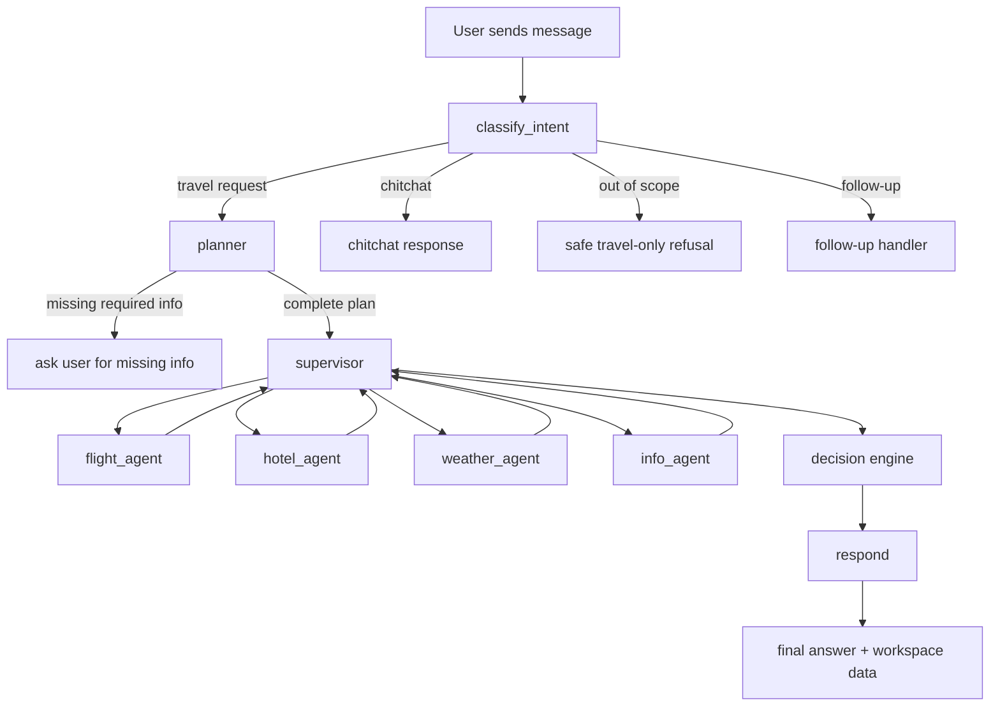

# Travel AI Agent - Current Status Report For PM

Last updated: 2026-06-27  
Prepared from current repository state: `C:\Users\VUDUYLINH\PycharmProjects\Travel AI Agent`

## 1. Executive Summary

Travel AI Agent is currently positioned as a decision-support travel planning product, not a generic chatbot and not an inspiration feed. The product sits after users already have travel ideas from TikTok, Google, or social content, then helps them decide whether a trip is feasible, affordable, and worth booking.

The current implementation has moved beyond simple flight and hotel lookup. The backend now includes a structured trip-planning flow, deterministic decision engine, cost estimation, itinerary building, route sanity checks, risk warnings, trip workspace APIs, usage tracking, export, and a simplified LangGraph flow without mandatory human confirmation or reflection in the normal MVP path.

The latest completed feature is `simplify-agent-flow`. It simplified the normal runtime path to:

```text
classify_intent -> planner -> supervisor -> agents -> decision -> respond
```

For non-travel or simple chat requests, the system exits early without invoking expensive travel tools.

Current status: MVP backend and frontend foundations are usable for demo and product iteration. The main product gap is no longer "can it search flights/hotels?" but "can it produce a trustworthy, actionable trip decision with enough live data quality, clear route feasibility, and polished user-facing controls?"

## 2. Product Direction

### Product Thesis

Users can already discover travel ideas through TikTok, Google, blogs, and social media. The harder problem is converting scattered inspiration into a trip they can actually take.

Travel AI Agent should answer:

- Can this trip fit my dates?
- Can this trip fit my budget?
- Are the places close enough to visit in the same day?
- Which option gives the best value?
- What should be removed if the schedule is too dense?
- What are the weather, cost, route, data quality, and booking risks?
- What should I do next?

### Target User For MVP

Vietnamese independent travelers planning short domestic or outbound trips.

Later expansion can support agencies through lead capture, itinerary generation, and handoff workflows, but those are outside the current MVP scope.

### Current Product Promise

Turn a loose travel request into a feasible itinerary with cost breakdown, route sanity checks, risk warnings, and a clear next action.

## 3. Current MVP Scope

### In Scope

- Natural-language trip request parsing.
- Structured trip plan creation.
- Editable trip plan fields.
- Tool-backed travel data when API keys are available.
- Cost estimation.
- Basic feasibility checks.
- Route and itinerary sanity checks.
- Final assistant response with itinerary, tradeoffs, risks, and next action.
- Trip workspace UI for plan, decision, costs, itinerary, risks, and actions.
- Session history and markdown export.
- Usage tracking for cost/LLM/tool visibility.

### Out Of Scope For Current MVP

- Full booking engine.
- Production-grade payment flow.
- Agency CRM/dashboard.
- Mobile app.
- Complex multi-provider pricing optimization.
- Adding more agents without clear user-facing decision value.
- Mandatory pre-provider human confirmation.

## 4. Current User Flow

### Main Travel Flow



### What Changed Recently

The previous normal flow included mandatory human confirmation and reflection. That made the product heavier and less direct for MVP usage.

Current flow removes the mandatory middle steps:

```text
Old: planner -> human_confirm -> supervisor -> agents -> reflect -> decision -> respond
New: planner -> supervisor -> agents -> decision -> respond
```

Resume endpoints still exist for future HITL use, but normal MVP travel flow does not trigger an interrupt. If a resume request is sent without a pending interrupt, the backend returns HTTP 409.

## 5. Current Functional Capabilities

### 5.1 Chat And Intent Routing

The app supports:

- Travel request handling.
- Chitchat handling without travel tools.
- Out-of-scope refusal for non-travel tasks.
- Follow-up handling.
- Streaming response through SSE.
- Session continuity using `session_id`.

Important invariant: LangGraph config preserves `thread_id=session_id`.

### 5.2 Trip Planning

The planner creates a structured `TripPlan` from natural language. It supports fields such as:

- Origin.
- Destination.
- Start date / end date.
- Number of days.
- Number of travelers.
- Budget.
- Currency.
- Preferences.
- Comfort level.
- Trip type.

If required information is missing, the planner can stop and ask for more details instead of running the full agent/tool flow prematurely.

### 5.3 Travel Data Retrieval

The system has provider/tool paths for:

- Flights.
- Hotels.
- Weather.
- Destination information.
- Places.
- Routes.
- Hotel review summaries.

Provider strategy:

- Uses live providers when API keys and data are available.
- Falls back to fixture/demo data only when demo mode or fallback logic allows it.
- Caches provider results per session/key to reduce repeated calls.
- Records provider errors and usage events.

### 5.4 Decision Engine

The deterministic decision layer is the strongest product differentiator currently in the repo. It is not just summarizing tool results; it produces structured decision output.

Current decision capabilities include:

- Cost breakdown.
- Total trip cost.
- Cost per person.
- Budget status.
- Budget delta.
- Ranked options.
- Recommended option.
- Tradeoff reasons.
- Feasibility scoring.
- Comfort scoring.
- Coverage status.
- Confidence level.
- Blocking reasons.
- Data freshness.
- Risk detection.
- Itinerary output.

Budget states include conditions such as under budget, near limit, slightly over, and over budget.

### 5.5 Itinerary And Route Sanity

The itinerary builder can:

- Cluster places into days.
- Control number of places per day based on comfort level.
- Estimate or use route travel time.
- Calculate daily travel minutes.
- Detect dense days.
- Detect long route risk.
- Detect backtracking.
- Detect weather-related activity impact.
- Suggest actions such as route optimization or removing/replacing places.

This means the project already contains the foundation for a route-sanity feature. The remaining product work is to make these warnings more visible, reliable, and actionable in the user experience.

### 5.6 Trip Workspace APIs

The backend exposes trip workspace endpoints for:

- Reading current trip workspace.
- Patching/editing trip plan.
- Reading decision result.
- Sending decision feedback.
- Executing trip actions.
- Exporting trip as Markdown.

Supported trip actions currently include:

- `optimize_day`
- `replace_place`

These actions are important because they move the product from "AI gives answer" to "user can revise the trip".

### 5.7 Frontend Workspace

The frontend is a React/Vite app with:

- Chat page.
- Streaming chat client.
- Session sidebar.
- Chat input.
- Trip workspace panel.
- Plan editor.
- Option comparison panel.
- Cost breakdown panel.
- Itinerary timeline.
- Risk panel.
- Typing/status indicator.

Current UI direction is a usable travel planning workspace rather than a marketing landing page.

### 5.8 Sessions, Usage, And Export

The app supports:

- Session list.
- Session detail/messages.
- Session delete/rename.
- Usage summary endpoint.
- Markdown export for trip result.

Usage tracking captures events such as request, tool call, LLM usage, plan completion, decision blocked, plan edited, action executed, and provider errors.

### 5.9 Authentication Status

The backend currently has auth endpoints:

- `POST /api/v1/auth/register`
- `POST /api/v1/auth/login`
- `POST /api/v1/auth/refresh`
- `POST /api/v1/auth/logout`

It also has user and refresh token persistence in SQLite, password hashing, JWT access tokens, and refresh token rotation.

However, auth is not fully productized yet:

- `get_current_user()` is temporarily bypassed and returns a demo user.
- Frontend does not currently contain login/register UI or attach auth tokens to API calls.
- Cookie security uses `secure=True`, which is production-oriented but can complicate local HTTP testing unless handled carefully.

PM-level status: backend auth foundation exists, but login is not a completed user-facing feature.

## 6. Architecture Overview

### Backend

- Framework: FastAPI.
- Agent orchestration: LangGraph.
- Backend package: `src/travel_ai_agent`.
- Graph entry: `src/travel_ai_agent/graphs/main_graph.py`.
- Chat router: `src/travel_ai_agent/api/routers/chat.py`.
- Trip router: `src/travel_ai_agent/api/routers/trips.py`.
- Session persistence: SQLite-backed `SessionStore`.
- Decision logic: `src/travel_ai_agent/decision`.
- Provider gateway: `src/travel_ai_agent/providers/gateway.py`.
- Tool wrappers: `src/travel_ai_agent/tools`.

### Frontend

- Framework: React with Vite.
- Main page: `frontend/src/pages/ChatPage.jsx`.
- Streaming client: `frontend/src/services/api.js`.
- Workspace components: `TripWorkspace`, `PlanEditor`, `OptionComparison`, `CostBreakdownPanel`, `ItineraryTimeline`, `RiskPanel`.

### Persistence

SQLite is used for:

- Sessions.
- Messages.
- Trips.
- Decisions.
- Usage events.
- Cache.
- Users.
- Refresh tokens.

LangGraph checkpoint persistence is configured with SQLite when available.

## 7. Verification Status

### Last Recorded Feature Verification

The latest completed feature `simplify-agent-flow` records:

- Python compile passed.
- Frontend lint/build passed.
- API smoke tests passed 10 scenarios:
  - Health.
  - Sessions.
  - Empty trip.
  - Chitchat.
  - Out-of-scope handling.
  - Travel stream.
  - Workspace draft.
  - Usage.
  - Export Markdown.
  - Resume guard 409.

### Verification Re-run For This Report

Commands run on 2026-06-27:

```powershell
python -m compileall src main.py
```

Result: passed.

```powershell
python -m pytest tests/test_decision_engine.py tests/test_itinerary_builder.py tests/test_coverage_gate.py tests/test_auth.py -q
```

Result: 22 tests passed.

Notes:

- Pytest showed cache write warnings because `.pytest_cache` could not be written in the current environment.
- These warnings did not fail the selected tests.
- Full frontend lint/build was not re-run for this report; the last recorded full frontend verification is from the completed `simplify-agent-flow` entry.

## 8. Current Repository State Notes

The workspace currently has many modified and untracked files, including backend, frontend, tests, docs, and harness files. This means the report reflects the current local workspace, not necessarily a clean committed branch.

Important implication for PM:

- Product and implementation status is good enough for planning/demo discussion.
- Before release or handoff, the team should commit or otherwise snapshot the current state and run full verification again.

## 9. Current Strengths

### Product Strengths

- Clear product positioning: decision support after inspiration.
- Good MVP focus: feasible itinerary, cost clarity, route sanity, risks, and next action.
- The system avoids becoming a generic chatbot.
- Decision Engine gives a concrete product differentiator.
- Structured workspace supports revision, not only one-shot answer.

### Engineering Strengths

- Backend is organized under `src/travel_ai_agent`.
- LangGraph flow is simpler and easier to demo after removing mandatory HITL/reflection.
- Deterministic services handle budget, coverage, cost, itinerary, and risk logic.
- Tool calls are avoided for chitchat/out-of-scope requests.
- SSE event contract is preserved.
- Session and trip persistence are present.
- Smoke tests and focused unit tests exist.
- Harness files exist for restartable work sessions.

### UX Strengths

- Chat remains the command surface.
- Structured trip state is rendered in workspace components.
- Cost, itinerary, options, risks, and plan editing are separated into domain components.
- Export exists, which helps demo and user handoff.

## 10. Current Gaps And Risks

### High Priority

1. Auth is not complete as a user-facing flow.
   Backend endpoints exist, but frontend login/register/token handling is not wired, and `get_current_user()` is still bypassed.

2. Data trust needs stronger PM-facing treatment.
   The system can use live data, fixtures, cached data, and heuristic fallbacks. The UI and final output must clearly explain what is verified, estimated, or demo-only.

3. Route sanity is present but should become more visible.
   Itinerary code can detect dense routes, long travel time, backtracking, and suggested actions. PM/user value will be higher if these are surfaced as clear warnings and one-click revisions.

4. Local workspace is not clean.
   Many files are modified or untracked. Before formal review, release, or team handoff, the repo needs a clean commit and full verification pass.

### Medium Priority

5. Frontend auth and ownership model are incomplete.
   Owner IDs are stored in backend/session data, but frontend requests are still effectively demo-user based.

6. Provider fallback behavior needs clearer acceptance rules.
   PM should decide when fixture/demo data is acceptable and when the product must block with "insufficient verified data".

7. Full end-to-end test coverage should be expanded.
   Existing focused tests are useful, but release confidence needs frontend + backend E2E flows around plan edit, action execution, and decision display.

8. Agency/lead handoff is not implemented.
   This is intentionally out of MVP, but PM should know that "next action" currently means product guidance/export/action, not production CRM or booking handoff.

## 11. Recommended Next Features

### Recommendation 1: Route Sanity Checker UX

Goal: Make the product clearly better than flight/hotel lookup by showing whether the itinerary is realistic.

User value:

- Detects too many places in one day.
- Warns about long travel time.
- Flags backtracking.
- Suggests removing, replacing, or reordering places.

Success metric:

- At least one clear route/density warning appears when the itinerary is unrealistic.
- User can trigger an action such as optimize day or replace place.

Suggested implementation scope:

- Reuse existing itinerary/risk logic.
- Improve UI surfacing in `RiskPanel` and `ItineraryTimeline`.
- Add stronger acceptance tests for dense itinerary cases.

### Recommendation 2: Budget What-if Engine

Goal: Let users understand how to make a trip fit budget.

User value:

- Shows what to reduce when over budget.
- Compares cheaper vs comfortable options.
- Explains cost delta.

Success metric:

- When over budget, user receives at least two concrete adjustment options.

Suggested implementation scope:

- Extend deterministic decision rules before adding new LLM calls.
- Add UI action for "make cheaper" or "reduce cost".

### Recommendation 3: Data Confidence Layer

Goal: Improve trust in AI output.

User value:

- User knows which data is live, estimated, fixture, or missing.
- Product avoids fake certainty.

Success metric:

- Every decision result displays coverage status and source confidence.
- Fixture/demo data is clearly marked.

Suggested implementation scope:

- Standardize labels in workspace UI.
- Add warnings in final response when data is not verified.

### Recommendation 4: Complete Login Flow

Goal: Make the app closer to a real product with user-owned sessions.

User value:

- User can register/login.
- Sessions/trips belong to the authenticated user.

Success metric:

- Login/register works from frontend.
- Authenticated requests identify the real user.
- Existing chat/trip flows continue working.

Suggested implementation scope:

- Wire frontend login/register UI.
- Replace bypassed `get_current_user()` with JWT validation.
- Attach access token to frontend API requests.
- Keep fallback demo mode only for local/demo if PM wants it.

### Recommendation 5: Shareable Trip Report / Lead Handoff

Goal: Turn planning output into a shareable artifact or agency lead.

User value:

- User can send the plan to friends or an agency.
- PM can demonstrate a business conversion path.

Success metric:

- User can export/share a structured itinerary with budget, risks, and next action.

Suggested implementation scope:

- Improve Markdown export formatting.
- Add share/download UI.
- Defer CRM integration until after MVP validation.

## 12. Suggested PM Decision

The next best product move is not adding more agents. The next best move is making the Decision Engine visible and actionable.

Recommended next active feature:

```text
Route Sanity Checker UX
```

Why:

- It directly addresses the current critique that the flow feels too simple.
- The backend already has much of the needed route/itinerary logic.
- It creates visible PM/user value beyond flight and hotel lookup.
- It can be implemented without changing the core LangGraph architecture.

Second priority:

```text
Complete Login Flow
```

Why:

- Backend foundation exists.
- It makes sessions and trip history feel product-ready.
- It is useful before any PM demo involving multiple users.

## 13. PM-Ready Status Verdict

Overall status: strong MVP foundation, not yet production-ready.

Demo readiness: good, assuming environment variables/providers are configured or demo mode is intentionally used.

Product readiness: partially ready. The current product can demonstrate trip planning, cost/risk/itinerary decision support, workspace editing, and export. It still needs stronger trust indicators, polished route sanity UX, completed auth frontend, and a clean release snapshot.

Production readiness: not yet. Before production release, the team should complete auth ownership, data confidence labeling, rate-limit/cost policy validation, full frontend/backend verification, and deployment hardening.

## 14. Immediate Next Actions

1. Choose `Route Sanity Checker UX` as the next active feature.
2. Commit or snapshot current workspace after PM review.
3. Run full verification: backend compile, focused pytest, frontend lint/build, API smoke test.
4. Decide provider policy: live-only vs demo fallback vs mixed with confidence labels.
5. Schedule login completion if PM wants multi-user demo or persistent user history.
